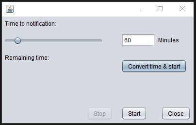

# Reminder

Build a simple JAVA Swing GUI with Apache Netbeans to create a Reminder
for regular water drinking during work. 

Type in a value between 0 - 600 (mins) or use the slider to choose
the desired period where the application should remind you to
drink water regularly.

## Authors

- [@Hendrik](https://www.github.com/henne23)

## Requirements

JRE - Java Runtime Environment \
opt.\
JDK - Java Development Kit

## Misc
